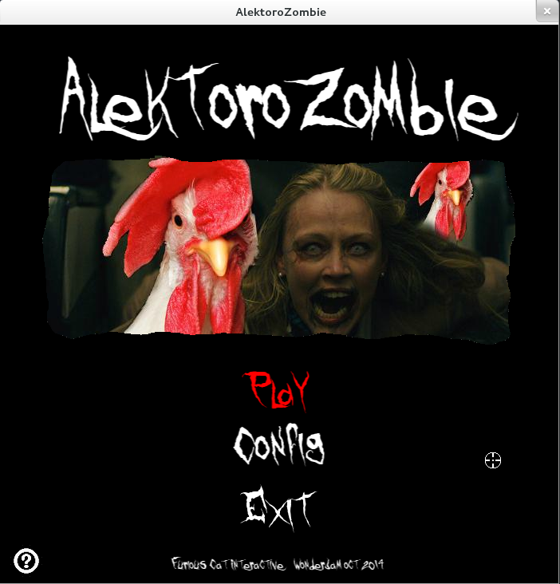
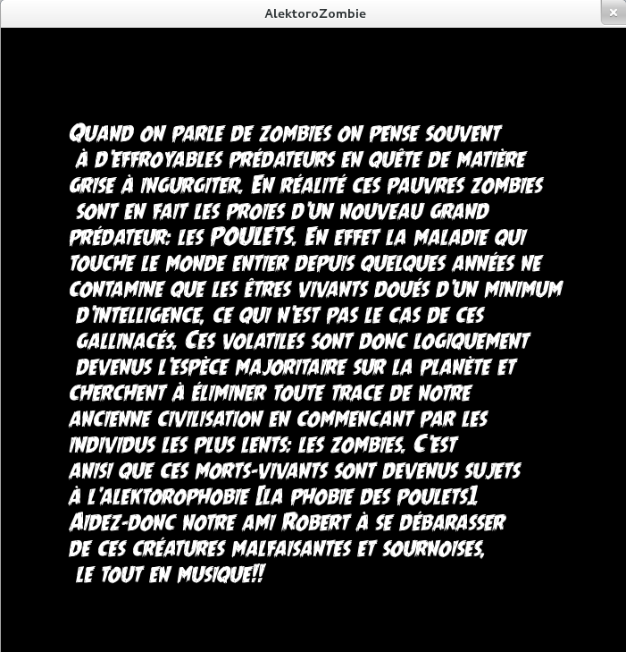
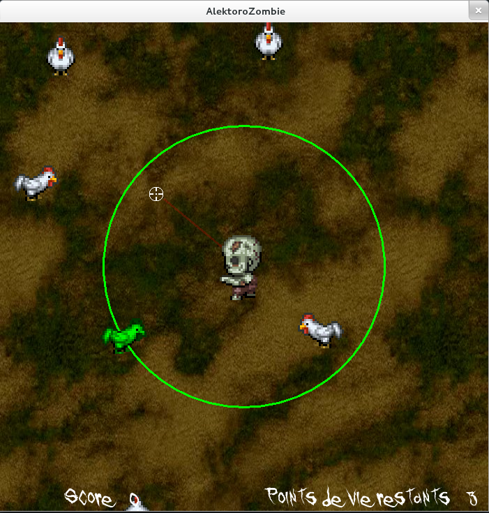

# OctoberWonderjam
# Team Furious Cat Interactive

## Description
Ce jeu vidéo à été conçu et réalisé en 48h lors de la WonderJam d'octobre de l'UQAC.

Le thème était: "La face cachée des Zombies!!!!" et les styles assignés à l'équipe étaient:
* jeu de tir 
* rythmique 

## Informations
Ce projet a été codé en java avec l'aide de la librairie JSFML et se joue à la souris.
Le but est de viser et tirer sur tous les poulets qui arrivent en rhytme avec la musique.

[lien pour télécharger l'éxécutable en .jar](https://www.dropbox.com/s/aku53hdu9udbgyz/AlektoroZombie%20-%20WonderJam.zip?dl=0)

## Screenshots

This software has been written by:
* Steven GERARD
* Steven FOUGERON
* Loïc TESSIER
* Corentin RAOULT
